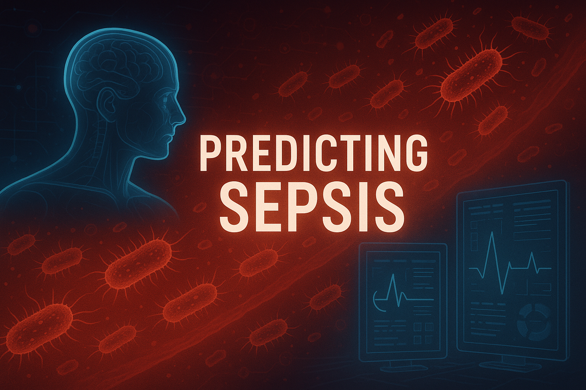

# Early Sepsis Prediction

## Repository Link

https://github.com/LucasNebelung/predicting_sepsis

## Description

This project focuses on **early detection of sepsis in ICU patients** using multivariate clinical time-series data from the **PhysioNet/Computing in Cardiology 2019 Challenge**.

The goal is to generate **hourly risk predictions** (`SepsisLabel`) early enough to support clinical intervention, while optimizing the official **clinical utility score** used in the challenge.

### Task Type

- **Problem:** Binary classification (hourly sepsis risk)
- **Output:** Predicted probability per patient-hour
- **Primary optimization target:** PhysioNet 2019 **Utility**

## Results Summary

### Best Model Performance

- **Best model:** **LightGBM** (high preprocessing: forward fill + dynamic recency)
- **Primary evaluation metric:** Official PhysioNet 2019 **Utility score**
- **Final test performance:**
  - **Utility:** **0.4158**
  - **AUROC:** 0.8535
  - **AUPRC:** 0.1353
  - **Accuracy:** 0.7849
  - **F1:** 0.1114

### Model Comparison (Test Utility)

1. **LightGBM (high preprocessing): 0.4158**
2. **Temporal Fusion Transformer (best run): 0.3988**
3. **iTransformer: 0.3887**
4. **PatchTST: 0.3756**
5. **Crossformer: 0.3577**
6. **TimesNet: 0.3332**
7. **qSOFA proxy baselines:** 0.0279 (threshold-optimized) / 0.0923 (aggressive alarm policy)

## Discussion

### When LightGBM Performs Better

LightGBM is usually the better choice when:
- data is limited,
- data is highly sparse (many missing values) and strongly imbalanced,
- fast training and robust performance are prioritized.

### When Temporal Fusion Transformer May Perform Better

TFT may become the better choice when:
- substantially more data is available,
- multimodal inputs are used (e.g., structured data + text/image embeddings),
- the task is more complex (e.g., multilabel prediction),
- sufficient GPU compute and tuning budget are available.

### Key Insights

- **Tree-based baseline strength:** LightGBM remained best in this project setting.
- **Deep model competitiveness:** TFT was the strongest deep-learning alternative and approached baseline performance.
- **Preprocessing impact:** Forward-fill with dynamic recency improved utility compared with raw/low-preprocessing variants.
- **Clinical relevance:** Utility-based evaluation is critical because prediction *timing* matters more than raw accuracy alone.
- **Main limitations:** Limited hyperparameter budget and mostly single-fold deep-model training likely constrained transformer performance.

## Dataset Snapshot

- **Source:** PhysioNet/CinC 2019 sepsis challenge data (Kaggle mirror used in workflow)
- **Scale:** 40,336 ICU stays and ~1.55M hourly rows
- **Class imbalance:**
  - Patient-level: ~7.3% septic / ~92.7% non-septic
  - Hour-level: ~1.8% positive / ~98.2% negative

## Evaluation Approach

All models are evaluated with the **official `evaluate_sepsis_score.py`** script from PhysioNet.

- A **threshold sweep** is run on `train_thresh` predictions.
- The threshold that maximizes utility is selected.
- Final scores are reported on the held-out test set.

This ensures standardized and fair comparison across all methods.

## Future Work

1. **Explainable AI for clinical trust**
   Use TFT attention/feature-importance visualizations and model explanations to make predictions easier for clinicians to interpret.
2. **Add richer clinical context (multimodal modeling)**
   Integrate structured ICU data with textual context (e.g., admission reason/notes) and potentially imaging features.
3. **Optimize training directly for clinical utility**
   Move beyond probability + threshold tuning toward objectives that more directly optimize utility (e.g., utility-aware training/RL-style optimization).
4. **Scale data and tasks**
   Train on larger external cohorts (e.g., MIMIC-IV, eICU) and extend to additional related labels (e.g., ARDS, heart failure risk) to improve generalization.

## Project Documentation

1. **[Literature Review](0_LiteratureReview/README.md)**
2. **[Dataset Characteristics](1_DatasetCharacteristics/README.md)**
3. **[Baseline Model](2_BaselineModel/README.md)**
4. **[Deep Learning Models](3_Model/README.md)**
5. **[Evaluation](4_Evaluation/README.md)**
6. **[Presentation](5_Presentation/README.md)**
## Cover Image

